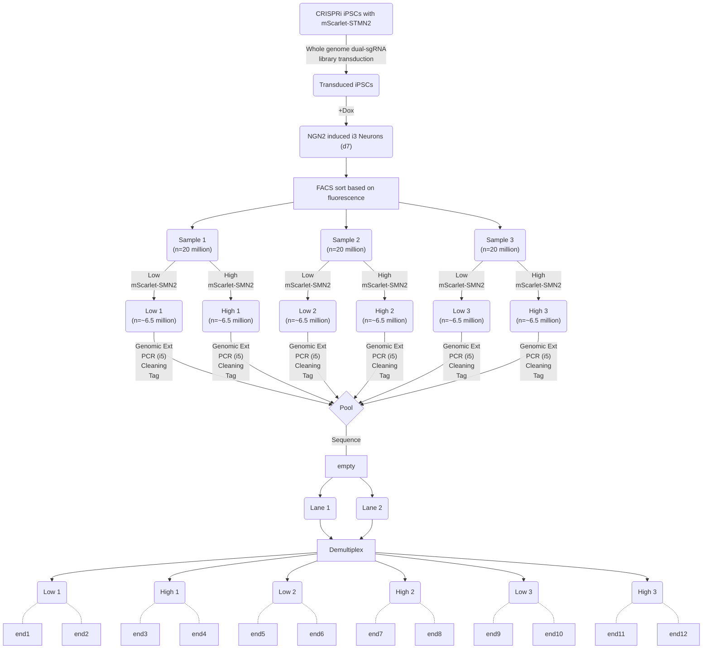
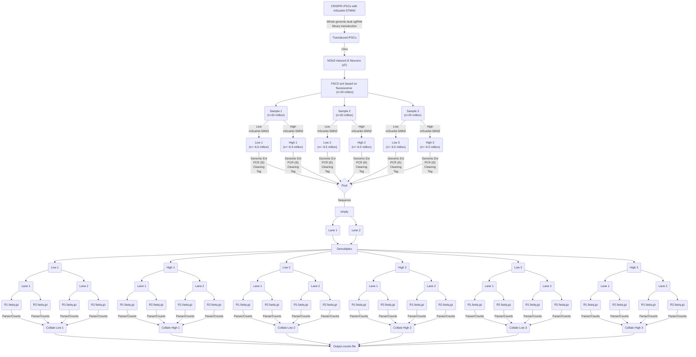
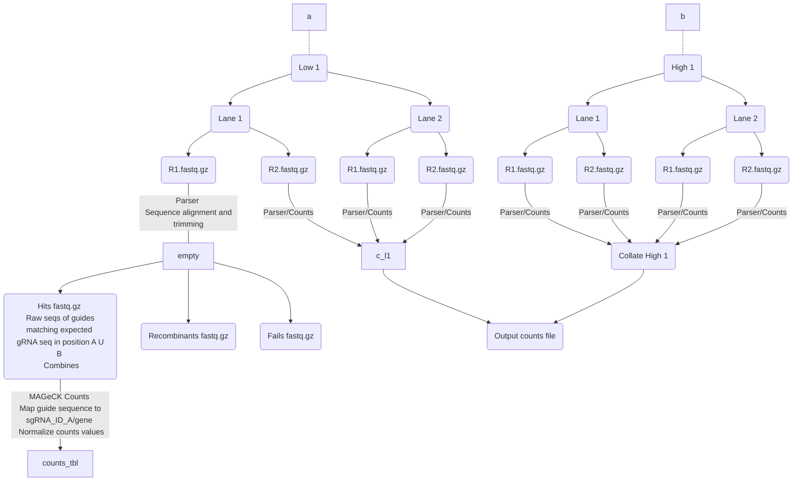

```mermaid
graph TB
%% Low 1
    a:::hidden-.-l1(Low 1)-->l1_ln1(Lane 1)
        l1_ln1-->l1_ln1_r1(R1.fastq.gz)-->|Parser/Counts| c_l1(Collate Low 1)
        l1_ln1-->l1_ln1_r2(R2.fastq.gz)-->|Parser/Counts| c_l1
        %% l1_ln1-->l1_ln1_r3(R3.fastq.gz)
    l1-->l1_ln2(Lane 2)
        l1_ln2-->l1_ln2_r1(R1.fastq.gz)-->|Parser/Counts| c_l1
        l1_ln2-->l1_ln2_r2(R2.fastq.gz)-->|Parser/Counts| c_l1
        %% l1_ln2-->l1_ln2_r3(R3.fastq.gz)
            c_l1-->cc(Output counts file)
%% High 1
    b:::hidden-.-h1(High 1)-->h1_ln1(Lane 1)
        h1_ln1-->h1_ln1_r1(R1.fastq.gz)-->|Parser/Counts| c_h1(Collate High 1)
        h1_ln1-->h1_ln1_r2(R2.fastq.gz)-->|Parser/Counts| c_h1
        %% h1_ln1-->h1_ln1_r3(R3.fastq.gz)
    h1-->h1_ln2(Lane 2)
        h1_ln2-->h1_ln2_r1(R1.fastq.gz)-->|Parser/Counts| c_h1
        h1_ln2-->h1_ln2_r2(R2.fastq.gz)-->|Parser/Counts| c_h1
        %% h1_ln2-->h1_ln2_r3(R3.fastq.gz)   
            c_h1-->cc

%% Low 2
    c:::hidden-.-l2(Low 2)-->l2_ln1(Lane 1)
        l2_ln1-->l2_ln1_r1(R1.fastq.gz)-->|Parser/Counts| c_l2(Collate Low 2)
        l2_ln1-->l2_ln1_r2(R2.fastq.gz)-->|Parser/Counts| c_l2
        %% l2_ln1-->l2_ln1_r3(R3.fastq.gz)
    l2-->l2_ln2(Lane 2)
        l2_ln2-->l2_ln2_r1(R1.fastq.gz)-->|Parser/Counts| c_l2
        l2_ln2-->l2_ln2_r2(R2.fastq.gz)-->|Parser/Counts| c_l2
        %% l2_ln2-->l2_ln2_r3(R3.fastq.gz)
                c_l2-->cc

%% High 2
    d:::hidden-.-h2(High 2)-->h2_ln1(Lane 1)
        h2_ln1-->h2_ln1_r1(R1.fastq.gz)-->|Parser/Counts| c_h2(Collate High 2)
        h2_ln1-->h2_ln1_r2(R2.fastq.gz)-->|Parser/Counts| c_h2
        %% h2_ln1-->h2_ln1_r3(R3.fastq.gz)
    h2-->h2_ln2(Lane 2)
        h2_ln2-->h2_ln2_r1(R1.fastq.gz)-->|Parser/Counts| c_h2
        h2_ln2-->h2_ln2_r2(R2.fastq.gz)-->|Parser/Counts| c_h2
        %% h2_ln2-->h2_ln2_r3(R3.fastq.gz)
                c_h2-->cc
%% Low 3
    e:::hidden-.-l3(Low 3)-->l3_ln1(Lane 1)
        l3_ln1-->l3_ln1_r1(R1.fastq.gz)-->|Parser/Counts| c_l3(Collate Low 3)
        l3_ln1-->l3_ln1_r2(R2.fastq.gz)-->|Parser/Counts| c_l3
        %% l3_ln1-->l3_ln1_r3(R3.fastq.gz)
    l3-->l3_ln2(Lane 2)
        l3_ln2-->l3_ln2_r1(R1.fastq.gz)-->|Parser/Counts| c_l3
        l3_ln2-->l3_ln2_r2(R2.fastq.gz)-->|Parser/Counts| c_l3
        %% l3_ln2-->l3_ln2_r3(R3.fastq.gz)
                c_l3-->cc

%% High 3
    f:::hidden-.-h3(High 3)-->h3_ln1(Lane 1)
        h3_ln1-->h3_ln1_r1(R1.fastq.gz)-->|Parser/Counts| c_h3(Collate High 3)
        h3_ln1-->h3_ln1_r2(R2.fastq.gz)-->|Parser/Counts| c_h3
        %% h3_ln1-->h3_ln1_r3(R3.fastq.gz)
    h3-->h3_ln2(Lane 2)
        h3_ln2-->h3_ln2_r1(R1.fastq.gz)-->|Parser/Counts| c_h3
        h3_ln2-->h3_ln2_r2(R2.fastq.gz)-->|Parser/Counts| c_h3
        %% h3_ln2-->h3_ln2_r3(R3.fastq.gz)
                c_h3-->cc
                
```

# Full Workflow - Too large for page, see enlarged graphs above




```python
from graphviz import Digraph

# Create a new directed graph
flowchart = Digraph(comment='Hamming Distance Calculation')

# Add nodes
flowchart.node('A', 'Start')
flowchart.node('B', 'Input two equal-length strings')
flowchart.node('C', 'Initialize a counter to 0')
flowchart.node('D', 'Iterate through each \n character in both strings')
flowchart.node('E', 'Compare corresponding \n characters')
flowchart.node('F', 'If characters differ, \n increment counter')
flowchart.node('G', 'After loop ends, \n output the counter as Hamming distance')
flowchart.node('H', 'End')

# Add edges
flowchart.edge('A', 'B')
flowchart.edge('B', 'C')
flowchart.edge('C', 'D')
flowchart.edge('D', 'E')
flowchart.edge('E', 'F')
flowchart.edge('F', 'D')
flowchart.edge('D', 'G', label='End of string')
flowchart.edge('G', 'H')

# Save the flowchart to a file and render it
flowchart.render('hamming_distance_flowchart', format='png', cleanup=True)

# Optional: Display the flowchart in a Jupyter notebook
flowchart.view()

```