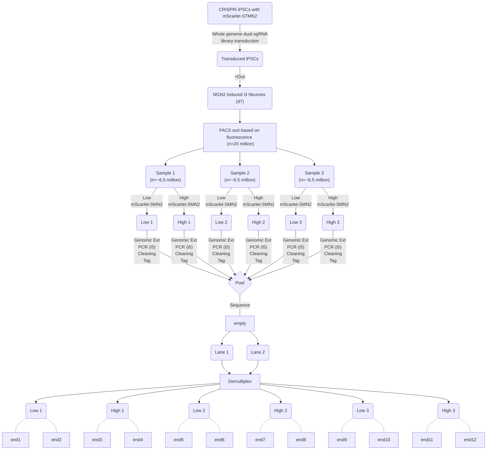
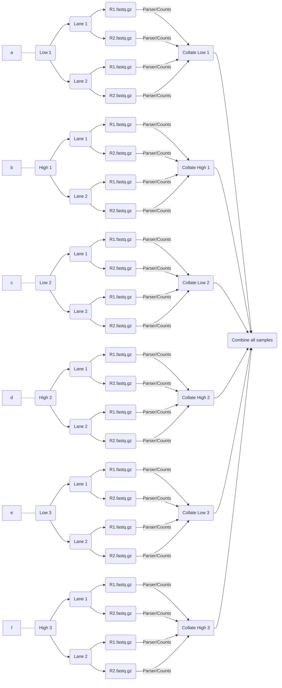

```mermaid
    graph TB
    A(CRISPRi iPSCs with mScarlet-STMN2)-->|Whole genome dual-sgRNA \n library transduction| B(Transduced iPSCs)
    B -->|+Dox| C("NGN2 induced i3 Neurons (d7)")
    C --> E["FACS sort based on fluorescence \n (n=20 million)"]

    E --> s1("Sample 1 \n (n=~6.5 million)")
    E --> s2("Sample 2 \n (n=~6.5 million)")
    E --> s3("Sample 3 \n (n=~6.5 million)")
    
    s1 -->|Low \n mScarlet-SMN2|L1(Low 1)-->|"Genomic Ext \n PCR (i5)" \n Cleaning \n Tag|pool{Pool}
    s1 -->|High \n mScarlet-SMN2|H1(High 1)-->|"Genomic Ext \n PCR (i5)" \n Cleaning \n Tag|pool
    s2 -->|Low \n mScarlet-SMN2|L2(Low 2)-->|"Genomic Ext \n PCR (i5)" \n Cleaning \n Tag|pool
    s2 -->|High \n mScarlet-SMN2|H2(High 2)-->|"Genomic Ext \n PCR (i5)" \n Cleaning \n Tag|pool
    s3 -->|Low \n mScarlet-SMN2|L3("Low 3")-->|"Genomic Ext \n PCR (i5)" \n Cleaning \n Tag|pool
    s3 -->|High \n mScarlet-SMN2|H3(High 3)-->|"Genomic Ext \n PCR (i5)" \n Cleaning \n Tag|pool

    pool---|Sequence|empty:::hidden
    empty-->lane1(Lane 1)-->Demultiplex
    empty-->lane2(Lane 2)-->Demultiplex
    Demultiplex-->l1(Low 1)-.-end1:::hidden
        l1-.-end2:::hidden
    Demultiplex-->h1(High 1)-.-end3:::hidden
        h1-.-end4:::hidden
    Demultiplex-->l2(Low 2)-.-end5:::hidden
        l2-.-end6:::hidden
    Demultiplex-->h2(High 2)-.-end7:::hidden
        h2-.-end8:::hidden
    Demultiplex-->l3(Low 3)-.-end9:::hidden
        l3-.-end10:::hidden
    Demultiplex-->h3(High 3)-.-end11:::hidden
        h3-.-end12:::hidden
        
```


```mermaid
graph LR
%% Low 1
    a:::hidden-.-l1(Low 1)-->l1_ln1(Lane 1)
        l1_ln1-->l1_ln1_r1(R1.fastq.gz)-->|Parser/Counts| c_l1(Collate Low 1)
        l1_ln1-->l1_ln1_r2(R2.fastq.gz)-->|Parser/Counts| c_l1
        %% l1_ln1-->l1_ln1_r3(R3.fastq.gz)
    l1-->l1_ln2(Lane 2)
        l1_ln2-->l1_ln2_r1(R1.fastq.gz)-->|Parser/Counts| c_l1
        l1_ln2-->l1_ln2_r2(R2.fastq.gz)-->|Parser/Counts| c_l1
        %% l1_ln2-->l1_ln2_r3(R3.fastq.gz)
            c_l1-->cc(Combine all samples)
%% High 1
    b:::hidden-.-h1(High 1)-->h1_ln1(Lane 1)
        h1_ln1-->h1_ln1_r1(R1.fastq.gz)-->|Parser/Counts| c_h1(Collate High 1)
        h1_ln1-->h1_ln1_r2(R2.fastq.gz)-->|Parser/Counts| c_h1
        %% h1_ln1-->h1_ln1_r3(R3.fastq.gz)
    h1-->h1_ln2(Lane 2)
        h1_ln2-->h1_ln2_r1(R1.fastq.gz)-->|Parser/Counts| c_h1
        h1_ln2-->h1_ln2_r2(R2.fastq.gz)-->|Parser/Counts| c_h1
        %% h1_ln2-->h1_ln2_r3(R3.fastq.gz)   
            c_h1-->cc

%% Low 2
    c:::hidden-.-l2(Low 2)-->l2_ln1(Lane 1)
        l2_ln1-->l2_ln1_r1(R1.fastq.gz)-->|Parser/Counts| c_l2(Collate Low 2)
        l2_ln1-->l2_ln1_r2(R2.fastq.gz)-->|Parser/Counts| c_l2
        %% l2_ln1-->l2_ln1_r3(R3.fastq.gz)
    l2-->l2_ln2(Lane 2)
        l2_ln2-->l2_ln2_r1(R1.fastq.gz)-->|Parser/Counts| c_l2
        l2_ln2-->l2_ln2_r2(R2.fastq.gz)-->|Parser/Counts| c_l2
        %% l2_ln2-->l2_ln2_r3(R3.fastq.gz)
                c_l2-->cc

%% High 2
    d:::hidden-.-h2(High 2)-->h2_ln1(Lane 1)
        h2_ln1-->h2_ln1_r1(R1.fastq.gz)-->|Parser/Counts| c_h2(Collate High 2)
        h2_ln1-->h2_ln1_r2(R2.fastq.gz)-->|Parser/Counts| c_h2
        %% h2_ln1-->h2_ln1_r3(R3.fastq.gz)
    h2-->h2_ln2(Lane 2)
        h2_ln2-->h2_ln2_r1(R1.fastq.gz)-->|Parser/Counts| c_h2
        h2_ln2-->h2_ln2_r2(R2.fastq.gz)-->|Parser/Counts| c_h2
        %% h2_ln2-->h2_ln2_r3(R3.fastq.gz)
                c_h2-->cc
%% Low 3
    e:::hidden-.-l3(Low 3)-->l3_ln1(Lane 1)
        l3_ln1-->l3_ln1_r1(R1.fastq.gz)-->|Parser/Counts| c_l3(Collate Low 3)
        l3_ln1-->l3_ln1_r2(R2.fastq.gz)-->|Parser/Counts| c_l3
        %% l3_ln1-->l3_ln1_r3(R3.fastq.gz)
    l3-->l3_ln2(Lane 2)
        l3_ln2-->l3_ln2_r1(R1.fastq.gz)-->|Parser/Counts| c_l3
        l3_ln2-->l3_ln2_r2(R2.fastq.gz)-->|Parser/Counts| c_l3
        %% l3_ln2-->l3_ln2_r3(R3.fastq.gz)
                c_l3-->cc

%% High 3
    f:::hidden-.-h3(High 3)-->h3_ln1(Lane 1)
        h3_ln1-->h3_ln1_r1(R1.fastq.gz)-->|Parser/Counts| c_h3(Collate High 3)
        h3_ln1-->h3_ln1_r2(R2.fastq.gz)-->|Parser/Counts| c_h3
        %% h3_ln1-->h3_ln1_r3(R3.fastq.gz)
    h3-->h3_ln2(Lane 2)
        h3_ln2-->h3_ln2_r1(R1.fastq.gz)-->|Parser/Counts| c_h3
        h3_ln2-->h3_ln2_r2(R2.fastq.gz)-->|Parser/Counts| c_h3
        %% h3_ln2-->h3_ln2_r3(R3.fastq.gz)
                c_h3-->cc
                
```

# Full Workflow - Too large for page, see enlarged graphs above

```mermaid
    graph TB
    A(CRISPRi iPSCs with mScarlet-STMN2)-->|Whole genome dual-sgRNA \n library transduction| B(Transduced iPSCs)
    B -->|+Dox| C("NGN2 induced i3 Neurons (d7)")
    C --> E["FACS sort based on fluorescence \n (n=20 million)"]

    E --> s1("Sample 1 \n (n=~6.5 million)")
    E --> s2("Sample 2 \n (n=~6.5 million)")
    E --> s3("Sample 3 \n (n=~6.5 million)")
    
    s1 -->|Low \n mScarlet-SMN2|L1(Low 1)-->|"Genomic Ext \n PCR (i5)" \n Cleaning \n Tag|pool{Pool}
    s1 -->|High \n mScarlet-SMN2|H1(High 1)-->|"Genomic Ext \n PCR (i5)" \n Cleaning \n Tag|pool
    s2 -->|Low \n mScarlet-SMN2|L2(Low 2)-->|"Genomic Ext \n PCR (i5)" \n Cleaning \n Tag|pool
    s2 -->|High \n mScarlet-SMN2|H2(High 2)-->|"Genomic Ext \n PCR (i5)" \n Cleaning \n Tag|pool
    s3 -->|Low \n mScarlet-SMN2|L3("Low 3")-->|"Genomic Ext \n PCR (i5)" \n Cleaning \n Tag|pool
    s3 -->|High \n mScarlet-SMN2|H3(High 3)-->|"Genomic Ext \n PCR (i5)" \n Cleaning \n Tag|pool

    pool---|Sequence|empty:::hidden
    empty-->lane1(Lane 1)-->Demultiplex
    empty-->lane2(Lane 2)-->Demultiplex
    Demultiplex-->l1(Low 1)
    Demultiplex-->h1(High 1)
    Demultiplex-->l2(Low 2)
    Demultiplex-->h2(High 2)
    Demultiplex-->l3(Low 3)
    Demultiplex-->h3(High 3)
    
    l1-->a1(R1.fastq.gz)
    l1-->a2(R2.fastq.gz)
    %% l1-->a3(R3.fastq.gz)
    h1-->b1(R1.fastq.gz)
    h1-->b2(R2.fastq.gz)
    %%  h1-->b3(R3.fastq.gz)
    l2-->c1(R1.fastq.gz)
    l2-->c2(R2.fastq.gz)
    %% l1-->c3(R3.fastq.gz)
    h2-->d1(R1.fastq.gz)
    h2-->d2(R2.fastq.gz)
    %% h2-->d3(R3.fastq.gz)
    l3-->e1(R1.fastq.gz)
    l3-->e2(R2.fastq.gz)
     %% l3-->e3(R3.fastq.gz)
    h3-->f1(R1.fastq.gz)
    h3-->f2(R2.fastq.gz)
    %% h3-->f3(R3.fastq.gz)
%%    a --> I("PCR \n (i5)")
%%    I --> J(Clean \n Samples)
%%    J --> K(Tag \n Station)
%% Low 1
    l1-->l1_ln1(Lane 1)
        l1_ln1-->l1_ln1_r1(R1.fastq.gz)
        l1_ln1-->l1_ln1_r2(R2.fastq.gz)
        %% l1_ln1-->l1_ln1_r3(R3.fastq.gz)
    l1-->l1_ln2(Lane 2)
        l1_ln2-->l1_ln2_r1(R1.fastq.gz)
        l1_ln2-->l1_ln2_r2(R2.fastq.gz)
        %% l1_ln2-->l1_ln2_r3(R3.fastq.gz)
%% High 1
    h1-->h1_ln1(Lane 1)
        h1_ln1-->h1_ln1_r1(R1.fastq.gz)
        h1_ln1-->h1_ln1_r2(R2.fastq.gz)
        %% h1_ln1-->h1_ln1_r3(R3.fastq.gz)
    h1-->h1_ln2(Lane 2)
        h1_ln2-->h1_ln2_r1(R1.fastq.gz)
        h1_ln2-->h1_ln2_r2(R2.fastq.gz)
        %% h1_ln2-->h1_ln2_r3(R3.fastq.gz)   
%% Low 2
    l2-->l2_ln1(Lane 1)
        l2_ln1-->l2_ln1_r1(R1.fastq.gz)
        l2_ln1-->l2_ln1_r2(R2.fastq.gz)
        %% l2_ln1-->l2_ln1_r3(R3.fastq.gz)
    l2-->l2_ln2(Lane 2)
        l2_ln2-->l2_ln2_r1(R1.fastq.gz)
        l2_ln2-->l2_ln2_r2(R2.fastq.gz)
        %% l2_ln2-->l2_ln2_r3(R3.fastq.gz)
%% High 2
    h2-->h2_ln1(Lane 1)
        h2_ln1-->h2_ln1_r1(R1.fastq.gz)
        h2_ln1-->h2_ln1_r2(R2.fastq.gz)
        %% h2_ln1-->h2_ln1_r3(R3.fastq.gz)
    h2-->h2_ln2(Lane 2)
        h2_ln2-->h2_ln2_r1(R1.fastq.gz)
        h2_ln2-->h2_ln2_r2(R2.fastq.gz)
        %% h2_ln2-->h2_ln2_r3(R3.fastq.gz)
%% Low 3
    l3-->l3_ln1(Lane 1)
        l3_ln1-->l3_ln1_r1(R1.fastq.gz)
        l3_ln1-->l3_ln1_r2(R2.fastq.gz)
        %% l3_ln1-->l3_ln1_r3(R3.fastq.gz)
    l3-->l3_ln2(Lane 2)
        l3_ln2-->l3_ln2_r1(R1.fastq.gz)
        l3_ln2-->l3_ln2_r2(R2.fastq.gz)
        %% l3_ln2-->l3_ln2_r3(R3.fastq.gz)
%% High 3
    h3-->h3_ln1(Lane 1)
        h3_ln1-->h3_ln1_r1(R1.fastq.gz)
        h3_ln1-->h3_ln1_r2(R2.fastq.gz)
        %% h3_ln1-->h3_ln1_r3(R3.fastq.gz)
    h3-->h3_ln2(Lane 2)
        h3_ln2-->h3_ln2_r1(R1.fastq.gz)
        h3_ln2-->h3_ln2_r2(R2.fastq.gz)
        %% h3_ln2-->h3_ln2_r3(R3.fastq.gz)
```

```